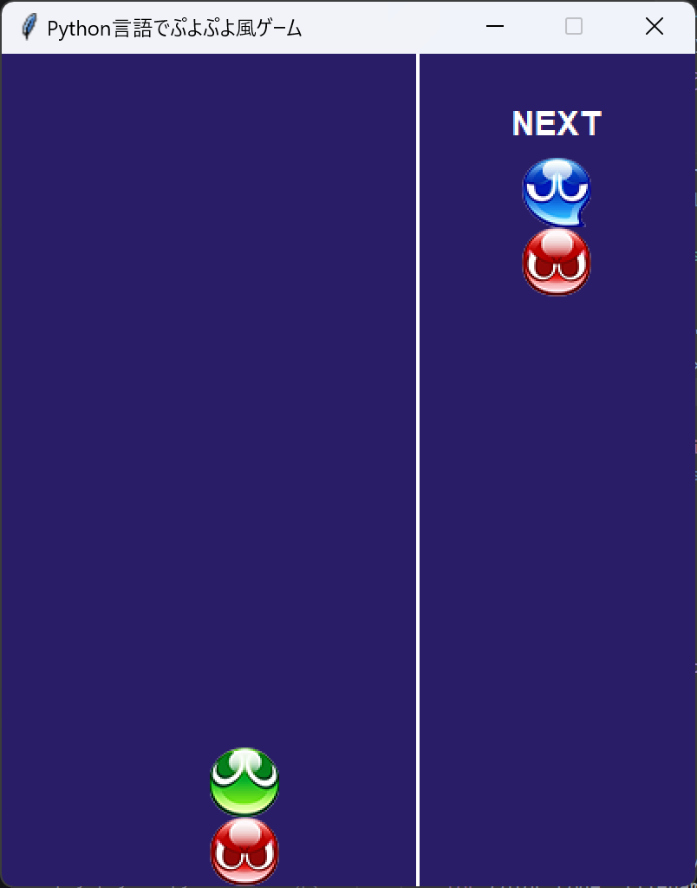

# 改造回：次に落ちてくるぷよを表示してみよう！

## 1. コードの追記・変更

コードのマス目（インデント）を揃えながら、下記の **「★【ここを変更】」** や **「★【ここを追記】」** がついている行をプログラムに反映させましょう。

今回の改造では、画面サイズを拡張し、次に落ちてくるぷよが表示されるようにします！

```python
BLOCK_SIZE = 40
SCREEN_WIDTH = GRID_COLS * BLOCK_SIZE + 160 # ★【ここを追記】
SCREEN_HEIGHT = GRID_ROWS * BLOCK_SIZE

    def __init__(self, root):
        # ~~~~~~~~~ 略 ~~~~~~~~~~
        self.load_images()
        # ★【ここから追記】
        self.puyo_queue = []
        for _ in range(2):
            self.puyo_queue.append([random.randint(1, 4), random.randint(1, 4)])    
        # ★【ここまで追記】

        self.spawn_puyo()
        self.game_loop()

    def spawn_puyo(self):
        self.puyo_colors = self.puyo_queue.pop(0)   # ★【ここを追記】
        self.puyo_queue.append([random.randint(1, 4), random.randint(1, 4)])    # ★【ここを変更】
        self.puyo_x = 3
        self.puyo_y = 0

    def draw(self):
        self.canvas.delete("all")

        # ★【ここから追記】
        field_right_x = GRID_COLS * BLOCK_SIZE
        self.canvas.create_line(field_right_x, 0, field_right_x, SCREEN_HEIGHT, fill="white", width=2)

        self.canvas.create_text(field_right_x + 80, 40, text="NEXT", fill="white", font=("Arial", 14, "bold"))
        next_colors = self.puyo_queue[0]
        self.draw_puyo_unit(field_right_x + 80, 80, next_colors[0])
        self.draw_puyo_unit(field_right_x + 80, 120, next_colors[1])
        # ★【ここまで追記】
        # ~~~~~~~~~ 略 ~~~~~~~~~~
                        self.canvas.create_oval(sx*BLOCK_SIZE+2, sy*BLOCK_SIZE+2, (sx+1)*BLOCK_SIZE-2,
                                                (sy+1)*BLOCK_SIZE-2, fill=COLORS[self.puyo_colors[1]], outline="white")
    # ★【ここから追記】
    def draw_puyo_unit(self, cx, cy, color):
        if self.puyo_images.get(color) is not None:
            self.canvas.create_image(cx, cy, image=self.puyo_images[color])
        else:
            r = BLOCK_SIZE / 2 - 2
            self.canvas.create_oval(cx - r, cy - r, cx + r, cy + r, fill=COLORS[color], outline="")
    # ★【ここまで追記】
```
コード入力後は実行してみましょう。エラーが出た場合は入力間違いとインデント（マス目）を見直してみましょう。

---

## 2. コード解説

* `SCREEN_WIDTH = ... + 160`：キャンバスの横幅を160px広げ、右側にNEXTぷよを描画するエリアを作ります。
* `self.puyo_queue`：これから出現するぷよのペア（組）にあらかじめ代入しておくためのリストです。
* `self.puyo_queue.pop(0)`：リストの先頭（0番目）から次のぷよデータを取り出し、現在の操作ぷよにします。
* `self.puyo_queue.append(...)`：取り出した分、新しいランダムなぷよペアをリストの末尾（後ろ）に追加します。
* `draw_puyo_unit()`：画像または円を共通処理で描画する関数です。NEXT表示のコードをすっきりさせます。

---

## 3. 完成イメージ



画面の右側に仕切り線と「NEXT」の表示領域が追加され、次に落ちてくるぷよの組み合わせがあらかじめ確認できるようになっていたら完成です！

---

## 4. 確認問題

**問1：リスト `queue = [10, 20, 30]` に対し、`x = queue.pop(0)` を実行した後の x の値と queue の状態として正しいものはどれですか？**
* ① x = 10, queue = [20, 30]
* ② x = 30, queue = [10, 20]
* ③ x = 10, queue = [10, 20, 30]
* ④ x = 30, queue = [20, 30]

A.＿＿＿＿＿＿＿＿＿＿＿＿＿＿＿＿＿＿＿＿＿＿＿＿＿＿＿＿＿
<!--
【解答】①
【解説】pop(0) はリストの「先頭（インデックス0）」要素を取り出して取得し、元のリストからは削除します。そのため x は 10 となり、queue は [20, 30] になります。
-->

**問2：`self.puyo_queue.append([1, 2])` を実行すると、リストの先頭（0番目の位置）に要素が追加される。 (○か×か)**

A.＿＿＿＿＿＿＿＿＿＿＿＿＿＿＿＿＿＿＿＿＿＿＿＿＿＿＿＿＿
<!--
【解答】×
【解説】append() メソッドは、リストの「末尾（一番後ろ）」に要素を追加します。先頭に追加する場合は insert(0, ...) を使用します。
-->

**問3：NEXT表示領域を作るために SCREEN_WIDTH の値を増やしたのは、Tkinterのキャンバス（Canvas）サイズを右方向に拡張するためである。 (○か×か)**

A.＿＿＿＿＿＿＿＿＿＿＿＿＿＿＿＿＿＿＿＿＿＿＿＿＿＿＿＿＿
<!--
【解答】○
【解説】キャンバスの横幅 (SCREEN_WIDTH) を広げることで、メインのゲーム盤面（6列分）の右側にNEXTを表示するスペースを確保しています。
-->

---

## 5. 発展課題

### 課題1：2個先に落ちてくるぷよ（NEXT2）も表示してみよう
さらに先を読むために、NEXT表示の下に「NEXT2」領域を追加して2個先のぷよまで表示してみましょう。
* ヒント：`__init__`で生成するキューの数を3個に増やし、draw 内で `self.puyo_queue[1]` のデータを読み出して描画します。

<!--
【発展課題1の参考コード】
def __init__(self, root):
    for _ in range(3):  # キューを3個分用意
        self.puyo_queue.append([random.randint(1, 4), random.randint(1, 4)])

def draw(self):
    self.canvas.create_text(field_right_x + 80, 180, text="NEXT2", fill="white", font=("Arial", 12))

    next2_colors = self.puyo_queue[1]
    self.draw_puyo_unit(field_right_x + 80, 210, next2_colors[0])
    self.draw_puyo_unit(field_right_x + 80, 250, next2_colors[1])
-->
