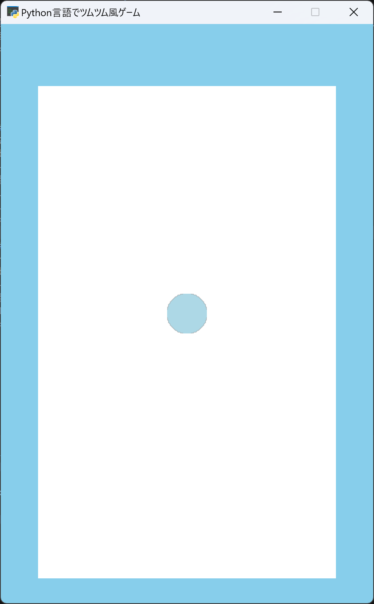

# 第1回：ゲーム画面を作って、ツムを表示してみよう！

## 0. Arcadeをインストールしよう

<!--
Python Arcadeライブラリは、Pythonで2Dゲームを簡単に作成するためのライブラリです。
このライブラリは、初心者や複雑なフレームワークを学ばずにゲームを作りたいプログラマーに最適で、物体の当たり判定やマップの読み込みなど、2Dゲーム開発に必要な機能が使えるようになります。
-->

VS Codeのターミナルを開き、次のコマンドを入力します。`pip install arcade`

<!--
インストールが終わったら、次のコマンドでArcadeが使えるか確認できます。

`python -c "import arcade; print(arcade.__version__)"`

バージョン番号が表示されれば準備完了です。

もし pip が使えない場合は、次のコマンドを試してください。

`python -m pip install arcade`
-->

---

## 1. プログラミングコードの記入

コードの行数やマス目（インデント）を揃えながらコードを入力していきましょう。

```python
 1 | import arcade
 2 | import random
 3 | import math
 4 |
 5 | WIDTH = 450
 6 | HEIGHT = 700
 7 | RADIUS = 24
 8 | FIELD_LEFT = 45
 9 | FIELD_RIGHT = 405
10 | FIELD_BOTTOM = 30
11 | FIELD_TOP = 625
12 |
13 | COLORS = [
14 |     arcade.color.RED,
15 |     arcade.color.PINK,
16 |     arcade.color.LIGHT_BLUE,
17 |     arcade.color.YELLOW,
18 |     arcade.color.GREEN
19 | ]
20 |
21 | class TsumuGame(arcade.Window):
22 |     def __init__(self):
23 |         super().__init__(
24 |             WIDTH,
25 |             HEIGHT,
26 |             "Python言語でツムツム風ゲーム"
27 |         )
28 |         self.tsumus = arcade.SpriteList()
29 |         self.add_tsumu()
30 |
31 |     def add_tsumu(self):
32 |         tsumu = arcade.SpriteCircle(
33 |             RADIUS,
34 |             random.choice(COLORS)
35 |         )
36 |         tsumu.center_x = WIDTH / 2
37 |         tsumu.center_y = HEIGHT / 2
38 |         self.tsumus.append(tsumu)
39 |
40 |     def on_draw(self):
41 |         self.clear(arcade.color.SKY_BLUE)
42 |
43 |         arcade.draw_lbwh_rectangle_filled(
44 |             FIELD_LEFT,
45 |             FIELD_BOTTOM,
46 |             FIELD_RIGHT - FIELD_LEFT,
47 |             FIELD_TOP - FIELD_BOTTOM,
48 |             arcade.color.WHITE
49 |         )
50 |         self.tsumus.draw()
51 |
52 | game = TsumuGame()
53 | arcade.run()
```

コード入力後は実行してみよう！もし、エラーが出た場合はコードを見直してみましょう。

---

## 2. コード解説

大事な所はコードにコメント（#）で書いておこう。

* `WIDTH`、`HEIGHT`：ゲーム画面の横幅と高さを設定します。

* `RADIUS`：ツムを円として表示するときの半径を設定します。

* `COLORS`：ツムに使用する色をリストとして用意しています。

* `TsumuGame`：ゲーム全体を管理するクラスです。

* `self.tsumus`：画面に表示するツムをまとめて管理します。

* `add_tsumu()`：新しいツムを1個作成して画面に追加する関数です。

* `random.choice()`：`COLORS` の中からランダムに1色を選びます。

* `on_draw()`：ゲーム画面を描画するときに自動的に呼び出されます。

---

## 3. 完成イメージ



青色のゲームウィンドウが表示され、その中央に色付きのツムが1個表示されていたら完成です！


---

## 4. 確認問題

**問1：リスト `COLORS` に5個の要素がある場合、`random.choice(COLORS)` が返すものとして正しいものを選びなさい。**
1. 必ず最初の要素
2. 必ず最後の要素
3. リストからランダムに選ばれた1つの要素
4. リストそのもの

A.＿＿＿＿＿＿＿＿＿＿＿＿＿＿＿＿＿＿＿＿＿＿＿＿＿＿＿＿＿
<!--
【解答】3
【解説】`random.choice()` は、指定されたリストなどからランダムに1つの要素を選びます。
-->

**問2：`self.tsumus` の役割として正しいものを選びなさい。**
1. ゲーム画面の大きさを決める
2. ツムをまとめて管理する
3. ツムの色だけを管理する
4. ゲームを終了する

A.＿＿＿＿＿＿＿＿＿＿＿＿＿＿＿＿＿＿＿＿＿＿＿＿＿＿＿＿＿
<!--
【解答】2
【解説】`self.tsumus` は `arcade.SpriteList()` として作られ、ゲーム内のツムをまとめて管理します。
-->

**問3： `arcade.SpriteCircle()` は何を作るために使用しますか？**
1. 円形のスプライト
2. 文字
3. 音楽
4. タイマー

A.＿＿＿＿＿＿＿＿＿＿＿＿＿＿＿＿＿＿＿＿＿＿＿＿＿＿＿＿＿
<!--
【解答】1
【解説】`arcade.SpriteCircle()` は円形のスプライトを作成するために使用します。今回はツムの表示に利用しています。
-->

---

## 5. 発展課題

### 課題1：ツムの位置を変更しよう
中央に表示されているツムを、画面の別の場所に表示してみましょう。
* ヒント：`center_x` と `center_y` の数値を変更します。
<!--
【参考コード】
tsumu.center_x = 150
tsumu.center_y = 400
-->

### 課題2：ツムの大きさを変更しよう

ツムを今より大きく表示してみましょう。
* ヒント：RADIUS の値を変更します。
<!--
【参考コード】
RADIUS = 35
-->

### 課題3：背景の色を変更しよう
ゲーム画面の背景を好きな色に変更してみましょう。
* ヒント：`arcade.color.SKY_BLUE` を別の色に変更します。
<!--
【参考コード例】
self.clear(arcade.color.BLACK)
-->
