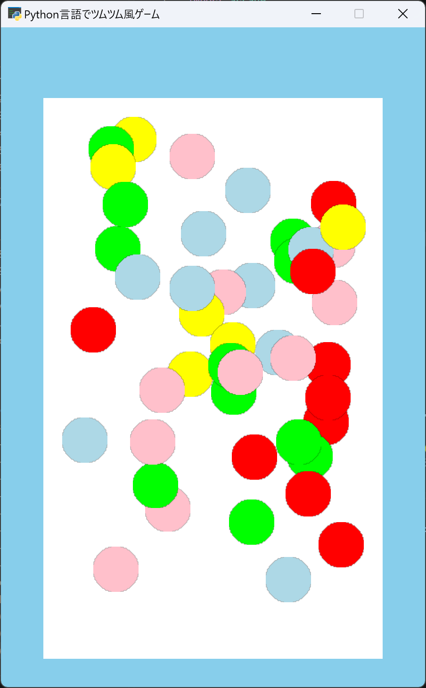

# 第2回：たくさんのツムを配置して、ゲームの動きを準備しよう！

## 1. プログラミングコードの記入

コードの行数やマス目（インデント）を揃えながら指定された場所にコードを**追記**していきましょう。

```python
 7 | RADIUS = 24
 8 | MAX_TSUMU = 45 # ★【ここから追記】
 9 | GAME_TIME = 60
10 | WALL = 18 # ★【ここまで追記】
11 | FIELD_LEFT = 45

31 |         self.tsumus = arcade.SpriteList()   
32 |         self.selected = [] # ★【ここから追記】
33 |         self.game_time = GAME_TIME
34 |         self.game_over = False
35 |         self.physics = arcade.PymunkPhysicsEngine(
36 |             gravity=(0, -700)
37 |         ) # ★【ここまで追記】
38 |         self.add_tsumu()
39 |         for _ in range(MAX_TSUMU - 1): # ★【ここから追記】
40 |             self.add_tsumu() # ★【ここまで追記】
41 |
42 |    def add_tsumu(self):

49 |         self.tsumus.append(tsumu)
50 |
51 |         tsumu.center_x = random.randint( # ★【ここから追記】
52 |             FIELD_LEFT + WALL + RADIUS,
53 |             FIELD_RIGHT - WALL - RADIUS
54 |         )
55 |
56 |         tsumu.center_y = random.randint(
57 |             FIELD_BOTTOM + WALL + RADIUS + 20,
58 |             FIELD_TOP - RADIUS
59 |         )
60 |
61 |         tsumu.type = tsumu.color
62 |         
63 |         self.physics.add_sprite(
64 |             tsumu,
65 |             mass=1,
66 |             elasticity=0.05,
67 |             friction=0.8,
68 |             damping=1.2
69 |         ) # ★【ここまで追記】
70 |         
71 |    def on_draw(self):
```

コード入力後は実行してみよう！もし、エラーが出た場合はコードを見直してみましょう。

<div style="page-break-before: always;"></div>

## 2. コード解説

大事な所はコードにコメント（#）で書いておこう。

* `MAX_TSUMU`：ゲーム内に用意するツムの最大数です。今回は `45` 個に設定します。

* `GAME_TIME`：ゲームで使用する制限時間です。今回は `60` 秒として準備します。

* `self.selected`：今後、マウスで選択したツムを保存するためのリストです。

* `self.game_time`：現在の残り時間を保存します。第5回で実際に減らしていきます。

* `self.game_over`：ゲームが終了したかを `True` または `False` で管理します。

* `PymunkPhysicsEngine`：ツムの重力や衝突などの物理演算を行うための機能です。

* `gravity=(0, -700)`：横方向を `0` 、下方向を `-700` として重力を設定しています。

* `for`：同じ処理を決められた回数だけ繰り返します。

* `random.randint()`：指定した範囲からランダムな整数を1つ選び、ツムの位置に利用します。

* `tsumu.type`：ツムの種類を保存します。今回はツムの色を種類として使用します。

* `add_sprite()`：作成したツムを物理演算の対象として登録します。

---

## 3. 完成イメージ



45個のツムがゲームフィールド内のさまざまな場所に表示され、プログラムを実行するたびに配置が変わっていれば完成です！

---

## 4. 確認問題

**問1：次のコードでは処理が何回繰り返されますか？** `for _ in range(5):`

1. 4回  
2. 5回  
3. 6回  
4. 無限に繰り返す  

A.＿＿＿＿＿＿＿＿＿＿＿＿＿＿＿＿＿＿＿＿＿＿＿＿＿＿＿＿＿

<!--
【解答】2
【解説】`range(5)` では `0` から `4` までの5回処理が繰り返されます。
-->

**問2： `MAX_TSUMU = 45` は何を表していますか？**

1. ツムの大きさ  
2. ツムの最大数  
3. ゲーム画面の高さ  
4. ゲーム時間  

A.＿＿＿＿＿＿＿＿＿＿＿＿＿＿＿＿＿＿＿＿＿＿＿＿＿＿＿＿＿

<!--
【解答】2
【解説】`MAX_TSUMU` には、ゲーム内に用意するツムの最大数として`45`を設定しています。
-->

**問3： `self.selected = []` の `[]` は空のリストを表している。 (○か×か)**

A.＿＿＿＿＿＿＿＿＿＿＿＿＿＿＿＿＿＿＿＿＿＿＿＿＿＿＿＿＿

<!--
【解答】○
【解説】`[]` は空のリストです。後の回で選択したツムを追加して使用します。
-->

**問4： `random.randint(10, 20)` の説明として正しいものを選びなさい。**

1. `10`から`20`までの整数からランダムに1つ選ぶ  
2. 必ず`10`を返す  
3. 必ず`20`を返す  
4. `10`と`20`を足す  

A.＿＿＿＿＿＿＿＿＿＿＿＿＿＿＿＿＿＿＿＿＿＿＿＿＿＿＿＿＿

<!--
【解答】1
【解説】`random.randint()` は指定した範囲からランダムな整数を返します。
-->

**問5： `self.game_over = False` の `False` はどの種類の値ですか？**

1. 整数  
2. 文字列  
3. 真偽値  
4. リスト  

A.＿＿＿＿＿＿＿＿＿＿＿＿＿＿＿＿＿＿＿＿＿＿＿＿＿＿＿＿＿

<!--
【解答】3
【解説】`True` と `False` は、条件の真・偽を表す真偽値です。
-->

---

## 5. 発展課題

### 課題1：ツムを画面上部に集めてみよう

ツムが画面の上側に多く配置されるように、`center_y`の出現範囲を変更してみましょう。

ヒント：`random.randint()`の最小値を大きくすると、ツムが出現する位置を上側にできます。

<!--
【参考コード】
tsumu.center_y = random.randint(
    350,
    FIELD_TOP - RADIUS
)
-->

### 課題2：ツムの数を変更してみよう

画面に表示するツムを`30`個に変更してみましょう。

ヒント：ツムの最大数を管理している`MAX_TSUMU`の値を確認します。

<!--
【参考コード】
MAX_TSUMU = 30
-->
