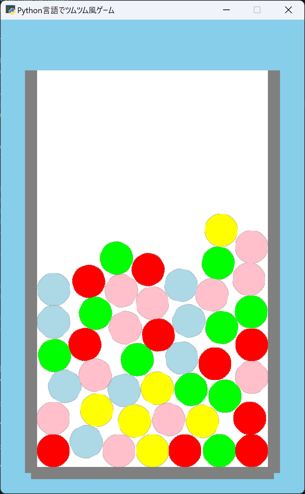

# 第3回：ツムを重力で落として、壁の中に積み上げよう！

## 1. プログラミングコードの記入

コードの行数やマス目（インデント）を揃えながら指定された場所にコードを**追記**していきましょう。

```python
39 |         for _ in range(MAX_TSUMU - 1):
40 |             self.add.tsumu()
41 |         
42 |         left_wall = arcade.SpriteSolidColor( # ★【ここから追記】
43 |             WALL,
44 |             FIELD_TOP - FIELD_BOTTOM,
45 |             arcade.color.GRAY
46 |         )
47 |
48 |         left_wall.center_x = FIELD_LEFT
49 |         left_wall.center_y = (
50 |             FIELD_BOTTOM + FIELD_TOP
51 |         ) / 2
52 |         
53 |         right_wall = arcade.SpriteSolidColor(
54 |             WALL,
55 |             FIELD_TOP - FIELD_BOTTOM,
56 |             arcade.color.GRAY
57 |         )
58 |
59 |         right_wall.center_x = FIELD_RIGHT
60 |         right_wall.center_y = (
61 |             FIELD_BOTTOM + FIELD_TOP
62 |         ) / 2
63 |
64 |         bottom_wall = arcade.SpriteSolidColor(
65 |             FIELD_RIGHT - FIELD_LEFT,
66 |             WALL,
67 |             arcade.color.GRAY
68 |         )
69 |
70 |         bottom_wall.center_x = (
71 |             FIELD_LEFT + FIELD_RIGHT
72 |         ) / 2
73 |         bottom_wall.center_y = FIELD_BOTTOM
74 |         
75 |         self.physics.add_sprite(
76 |             left_wall,
77 |             body_type=arcade.PymunkPhysicsEngine.STATIC
78 |         )
79 |
80 |         self.physics.add_sprite(
81 |             right_wall,
82 |             body_type=arcade.PymunkPhysicsEngine.STATIC
83 |         )
84 |
85 |         self.physics.add_sprite(
86 |             bottom_wall,
87 |             body_type=arcade.PymunkPhysicsEngine.STATIC
88 |         ) # ★【ここまで追記】
89 |
90 |    def add_tsumu(self):

129|         self.tsumus.draw()
130|         
131|         arcade.draw_lbwh_rectangle_filled( # ★【ここから追記】
132|             FIELD_LEFT - WALL / 2,
133|             FIELD_BOTTOM,
134|             WALL,
135|             FIELD_TOP - FIELD_BOTTOM,
136|             arcade.color.GRAY
137|         )
138|
139|         arcade.draw_lbwh_rectangle_filled(
140|             FIELD_RIGHT - WALL / 2,
141|             FIELD_BOTTOM,
142|             WALL,
143|             FIELD_TOP - FIELD_BOTTOM,
144|             arcade.color.GRAY
145|         )
146|
147|         arcade.draw_lbwh_rectangle_filled(
148|             FIELD_LEFT,
149|             FIELD_BOTTOM - WALL / 2,
150|             FIELD_RIGHT - FIELD_LEFT,
151|             WALL,
152|             arcade.color.GRAY
153|         )
154|     
155|     def on_update(self, dt):
156|         if self.game_over:
157|             return
158|
159|         self.physics.step()
160|
161|         for tsumu in self.tsumus:
162|
163|             tsumu.center_x = max(
164|                 FIELD_LEFT + WALL / 2 + RADIUS,
165|                 min(
166|                     tsumu.center_x,
167|                     FIELD_RIGHT - WALL / 2 - RADIUS
168|                 )
169|             )
170|
171|             tsumu.center_y = max(
172|                 FIELD_BOTTOM + WALL / 2 + RADIUS,
173|                 tsumu.center_y
174|             ) # ★【ここまで追記】
175|
176| game = TsumuGame()
```

コード入力後は実行してみよう！もし、エラーが出た場合はコードを見直してみましょう。

---

## 2. コード解説

大事な所はコードにコメント（#）で書いておこう。

* `SpriteSolidColor()`：指定した大きさと色の四角形スプライトを作ります。今回は壁として使用します。

* `left_wall`、`right_wall`、`bottom_wall`：それぞれ左・右・下の壁を保存する変数です。

* `STATIC`：物理演算で動かない物体として登録します。ツムがぶつかっても壁は移動しません。

* `on_update()`：ゲームの実行中に繰り返し呼び出され、ゲーム内の動きを更新する関数です。

* `dt`：前回の更新から今回の更新までに経過した時間を表します。

* `self.physics.step()`：第2回で準備した物理演算を進めます。これにより`gravity=(0, -700)`がツムに働きます。

* `for tsumu in self.tsumus`：登録されているツムを1個ずつ順番に処理します。

* `max()`：指定された値より小さくならないようにします。今回はツムが壁の下へ出ることを防ぎます。

* `min()`：指定された値より大きくならないようにします。`max()`と組み合わせて左右の範囲を制限します。

---

## 3. 完成イメージ（今回の動く様子）



ランダムな位置に生成されたツムが下方向へ落下し、ツム同士がぶつかりながら左右と下の壁の中に積み重なっていれば完成です！

---

## 4. 確認問題

**問1： `gravity=(0, -700)` によってツムはどの方向へ動きますか？**

1. 上方向
2. 下方向
3. 左方向
4. 右方向

A.＿＿＿＿＿＿＿＿＿＿＿＿＿＿＿＿＿＿＿＿＿＿＿＿＿＿＿＿＿

<!--
【解答】2
【解説】2つ目の値が縦方向を表し、負の値なので下方向へ重力が働きます。
-->

**問5：壁に `STATIC` を設定する理由として正しいものを選びなさい。**

1. 壁をランダムに動かすため
2. 壁を落下させるため
3. 壁を動かない物体にするため
4. 壁を透明にするため

A.＿＿＿＿＿＿＿＿＿＿＿＿＿＿＿＿＿＿＿＿＿＿＿＿＿＿＿＿＿

<!--
【解答】3
【解説】`STATIC`を指定すると、物理演算の影響を受けても移動しない物体として扱われます。
-->

**問3： `self.physics.step()` を実行すると、登録した物体の物理演算が進む。 (○か×か)**

A.＿＿＿＿＿＿＿＿＿＿＿＿＿＿＿＿＿＿＿＿＿＿＿＿＿＿＿＿＿

<!--
【解答】○
【解説】第2回では物理演算への登録だけでしたが、`self.physics.step()`を実行することで重力や衝突が反映されます。
-->

**問4：次のコードの結果として正しいものを選びなさい。** `max(10, 5)`

1. `5`
2. `10`
3. `15`
4. `50`

A.＿＿＿＿＿＿＿＿＿＿＿＿＿＿＿＿＿＿＿＿＿＿＿＿＿＿＿＿＿

<!--
【解答】2
【解説】`max()`は与えられた値の中から最も大きな値を返すため、結果は`10`です。
-->

**問5： `for tsumu in self.tsumus:` は何を行っていますか？**

1. ツムを1個だけ作る
2. ツムをすべて削除する
3. ツムを1個ずつ順番に処理する
4. ツムの色を変更する

A.＿＿＿＿＿＿＿＿＿＿＿＿＿＿＿＿＿＿＿＿＿＿＿＿＿＿＿＿＿

<!--
【解答】3
【解説】`for`文を使って、`self.tsumus`に保存されているツムを1個ずつ処理しています。
-->

---

## 5. 発展課題

### 課題1：重力を調整してみよう

ツムの落下速度を変更してみましょう。

ヒント：第2回で設定した `gravity=(0, -700)` の縦方向の数値を変更します。負の値を大きくすると、下方向への重力が強くなります。逆に、負の値が `0` に近くなると重力が弱くなります。

<!--
【参考コード】
self.physics = arcade.PymunkPhysicsEngine(
    gravity=(0, -900)
)
-->

### 課題2：壁の太さを変えてみよう

左右と下に表示される壁を太くして、ゲーム画面がどのように変化するか確認してみましょう。

ヒント：壁の太さは第2回で用意した `WALL` によって管理されています。

<!--
【参考コード】
WALL = 25
-->