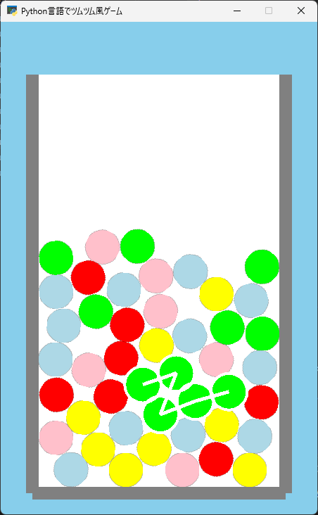

# 第4回：同じ色のツムをマウスでつないでみよう！

## 1. コードの追記

コードの行数やマス目（インデント）を揃えながら指定された場所にコードを**追記**していきましょう。

```python
152|             arcade.color.GRAY
153|         )
154|     # ★【ここから追記】
155|         if len(self.selected) > 1:
156|
157|             points = []
158|
159|             for tsumu in self.selected:
160|                 points.append(
161|                     (
162|                         tsumu.center_x,
163|                         tsumu.center_y
164|                     )
165|                 )
166|
167|             arcade.draw_line_strip(
168|                 points,
169|                 arcade.color.WHITE,
170|                 5
171|             )
172|         
173|         for tsumu in self.selected:
174|
175|             arcade.draw_circle_outline(
176|                 tsumu.center_x,
177|                 tsumu.center_y,
178|                 RADIUS + 4,
179|                 arcade.color.WHITE,
180|                 4
181|             )
182|     # ★【ここまで追記】
183|     def on_update(self,dt):        

201|                 tsumu.center_y
202|             )
203|     # ★【ここから追記】
204|     def get_tsumu(self, x, y):
205|
206|         for tsumu in reversed(self.tsumus):
207|
208|             if math.hypot(
209|                 tsumu.center_x - x,
210|                 tsumu.center_y - y
211|             ) <= RADIUS + 8:
212|                 return tsumu
213|
214|         return None
215|     
216|     def on_mouse_press(
217|         self,
218|         x,
219|         y,
220|         button,
221|         modifiers
222|     ):
223|
224|         tsumu = self.get_tsumu(x, y)
225|
226|         if tsumu:
227|             self.selected = [tsumu]
228|  
229|     def on_mouse_drag(
230|         self,
231|         x,
232|         y,
233|         dx,
234|         dy,
235|         buttons,
236|         modifiers
237|     ):
238|
239|         if not self.selected:
240|             return
241|
242|         tsumu = self.get_tsumu(x, y)
243|
244|         if not tsumu:
245|             return
246|
247|         if tsumu in self.selected:
248|             return
249|
250|         if tsumu.type != self.selected[0].type:
251|             return
252|
253|         distance = math.hypot(
254|             tsumu.center_x -
255|             self.selected[-1].center_x,
256|             tsumu.center_y -
257|             self.selected[-1].center_y
258|         )
259|
260|         if distance < RADIUS * 3:
261|             self.selected.append(tsumu)
262|     # ★【ここまで追記】
263| game = TsumuGame()
```

コード入力後は実行してみましょう！もし、エラーが出た場合はコードを見直してみましょう。

---

## 2. コード解説

* `get_tsumu()`：マウスの位置にツムがあるかを調べ、見つかったツムを返します。

* `math.hypot()`：2点間の距離を計算します。マウスとツム、ツム同士の距離判定に使用します。

* `reversed()`：`self.tsumus`を後ろから順番に調べます。

* `return`：関数の処理を終了します。`return tsumu`では見つけたツムも返します。

* `on_mouse_press()`：マウスのボタンを押したときに実行される処理です。

* `on_mouse_drag()`：マウスボタンを押したまま動かしたときに繰り返し実行されます。

* `tsumu in self.selected`：そのツムがすでに選択されているかを調べます。

* `tsumu.type != self.selected[0].type`：最初に選んだツムと色が異なる場合、選択しないようにします。

* `self.selected[-1]`：現在選択しているツムの中で、最後に追加されたツムを取得します。

* `append()`：リストの最後に新しい要素を追加します。

---

## 3. 完成イメージ（今回の動く様子）



マウスでツムをクリックした時にツムの周りに白い枠が表示され、近くにある同じ色のツムへドラッグすると白い線でつながるようになっていれば完成です！

---

## 4. 確認問題

**問1： `on_mouse_press()` はいつ実行される処理ですか？** A.＿＿＿＿＿＿＿＿＿＿

１. キーボードを押したとき　２. マウスのボタンを押したとき

３. ゲームを終了したとき　４. ツムが落下したとき

<!--
【解答】2
【解説】`on_mouse_press()`はマウスボタンを押したときに呼び出されます。
-->

**問2： `self.selected.append(tsumu)` は何をしていますか？** A.＿＿＿＿＿＿＿＿＿＿

１. ツムを削除する　２. 選択したツムをリストに追加する

３. ツムの色を変える　４. ツムを落下させる

<!--
【解答】2
【解説】`append()`はリストの最後に要素を追加するメソッドです。
-->

**問３：次のリストで`items[-1]`が取得する値はどれですか？** A.＿＿＿＿＿＿＿＿＿＿

`items = [10, 20, 30]`

１. `10` ２. `20`

３. `30` ４. エラーになる

<!--
【解答】3
【解説】Pythonでは添字`-1`を指定すると、リストの最後の要素を取得できます。
-->

**問4： `return None` は何を表していますか？** A.＿＿＿＿＿＿＿＿＿＿

１. ツムが見つからなかった　２. ツムを追加した

３. ゲームが終了した　４. ツムが消えた

<!--
【解答】1
【解説】`get_tsumu()`で条件に合うツムが見つからなかった場合、`None`を返しています。
-->

---

## 5. 発展課題

### 課題1：つなげられる距離を短くしてみよう

現在より遠くのツムをつなげられるように変更してみましょう。

ヒント：距離判定に使用している`RADIUS * 3`の数値を変更します。

<!--
【参考コード】
if distance < RADIUS * 2:
    self.selected.append(tsumu)
-->

### 課題2：白い線を太くしてみよう

選択したツム同士をつないでいる線を太くしてみましょう。

ヒント：`arcade.draw_line_strip()`の最後の数値が線の太さです。

<!--
【参考コード】
arcade.draw_line_strip(
    points,
    arcade.color.WHITE,
    30
)
-->

### 課題3：選択したツムの枠の色を変えてみよう

ツムの周りに表示される円の色を変更してみましょう。

ヒント：`arcade.draw_circle_outline()`内を変更します。

<!--
【参考コード】
arcade.draw_circle_outline(
    tsumu.center_x,
    tsumu.center_y,
    RADIUS + 4,
    arcade.color.BLACK,
    4
)
-->
