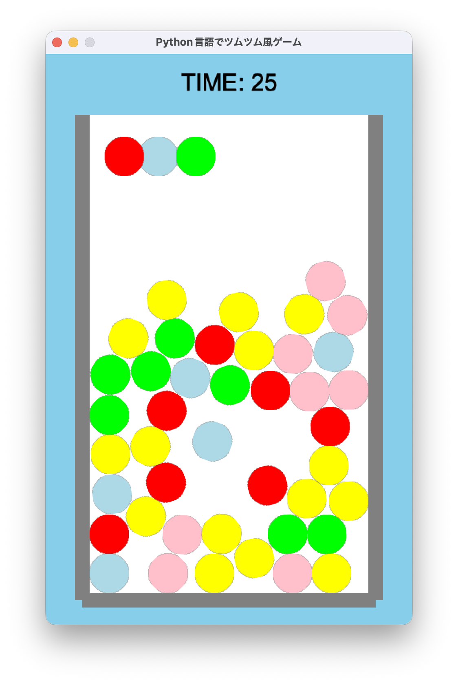

# 第5回：ツムを消して、制限時間付きゲームを完成させよう！

## 1. コードの追記

コードの行数やマス目（インデント）を揃えながら指定された場所にコードを**追記**していきましょう。

```python
87 |             body_type=arcade.PymunkPhysicsEngine.STATIC
88 |         )
89 |     # ★【ここから追記】
90 |     def add_new_tsumu(self):
91 |         tsumu = arcade.SpriteCircle(
92 |             RADIUS,
93 |             random.choice(COLORS)
94 |         )
95 |
96 |         tsumu.center_x = random.randint(
97 |             FIELD_LEFT + WALL + RADIUS,
98 |             FIELD_RIGHT - WALL - RADIUS
99 |         )
100|
101|         tsumu.center_y = FIELD_TOP - RADIUS
102|         tsumu.type = tsumu.color
103|
104|         self.tsumus.append(tsumu)
105|
106|         self.physics.add_sprite(
107|             tsumu,
108|             mass = 1,
109|             elasticity = 0.05,
110|             friction = 0.8,
111|             damping = 1.2
112|         )
113|     # ★【ここまで追記】
114|     def add_tsumu(self):

193|                 arcade.color.WHITE,
194|                 5
195|             )
196|         # ★【ここから追記】
197|         arcade.draw_text(
198|             f"TIME: {int(self.game_time)}",
199|             WIDTH / 2,
200|             655,
201|             arcade.color.BLACK,
202|             22,
203|             anchor_x="center"
204|         )
205|         # ★【ここまで追記】
206|         for tsumu in self.selected:

217|         if self.game_over:
218|             return
219|         # ★【ここから追記】
220|         self.game_time -= dt
121|
222|         if self.game_time <= 0:
223|             self.game_time = 0
224|             self.game_over = True
225|             self.close()
226|             return
227|         
228|         while len(self.tsumus) < MAX_TSUMU:
229|             self.add_new_tsumu()
230|         # ★【ここまで追記】
231|         self.physics.step()

245|                 tsumu.center_y
246|             )
247|     # ★【ここから追記】
248|     def on_mouse_release(
249|         self,
250|         x,
251|         y,
252|         button,
253|         modifiers
254|     ):
255|
256|         if len(self.selected) >= 3:
257|             for tsumu in self.selected:
258|                 self.tsumus.remove(tsumu)
259|                 self.physics.remove_sprite(tsumu)
260|
261|         self.selected = []
262|     # ★【ここまで追記】
262|     def get_tsumu(self, x, y):
```

コード入力後は実行してみましょう！もし、エラーが出た場合はコードを見直してみましょう。

---

## 2. コード解説

* `add_new_tsumu()`：消したツムの代わりとなる新しいツムを、フィールド上部に作成します。

* `f"TIME: {int(self.game_time)}"`：現在の残り時間を文字列に入れて表示します。

* `int()`：小数を整数に変換します。残り時間を見やすく表示するために使用します。

* `self.game_time -= dt`：前回の更新から経過した時間を引いて、残り時間を減らします。

* `self.game_time <= 0`：残り時間が0以下になったかを調べます。

* `self.close()`：ゲームのウィンドウを閉じます。

* `while len(self.tsumus) < MAX_TSUMU`：ツムが45個より少ない間、新しいツムを追加します。

* `on_mouse_release()`：マウスのボタンを離したときに実行される処理です。

* `len(self.selected) >= 3`：選択したツムが3個以上あるかを調べます。

* `remove()`：指定した値をリストから削除します。

* `remove_sprite()`：物理演算からもツムを削除します。

* `self.selected = []`：選択状態を空にして、次の操作に備えます。

---

## 3. 完成イメージ（今回の動く様子）



同じ色のツムを3個以上つないでマウスを離すとツムが消え、消えた分だけ上から新しいツムが落ちてきます。画面上部には残り時間が表示され、60秒経過するとゲーム画面が閉じれば完成です！

---

## 4. 確認問題

**問1： `self.close()`　は何をする処理ですか？** A.＿＿＿＿＿＿＿＿＿＿

１. ツムを削除する　２. ゲームウィンドウを閉じる

３. ツムを追加する　４. 残り時間を増やす

<!--
【解答】2
【解説】`self.close()`を実行すると、ゲームウィンドウが閉じます。
-->

**問2： `items = [10, 20, 30]` `items.remove(20)` を実行した後の　`items`　として正しいものを選びなさい。** A.＿＿＿＿＿＿＿＿＿＿

１. `[10, 20]`　２. `[20, 30]`

３. `[10, 30]`　４. `[]`

<!--
【解答】3
【解説】`remove(20)`によって、リストから値`20`が削除されます。
-->

**問3： `while len(self.tsumus) < MAX_TSUMU:`　の役割として正しいものを選びなさい。** A.＿＿＿＿＿＿＿＿＿＿

１. ツムをすべて削除する　２. ツムの色を変更する

３. ツムが最大数になるまで補充する　４. ゲーム時間を増やす

<!--
【解答】3
【解説】ツムの数が`MAX_TSUMU`より少ない間、`add_new_tsumu()`を繰り返して補充します。
-->

---

## 5. 発展課題

### 課題1：2個から消せるようにしてみよう

現在は3個以上のツムをつなぐと消えます。2個以上で消えるように変更してみましょう。

ヒント：選択数を確認している `len(self.selected) >= 3` の数値を変更します。

<!--
【参考コード】
if len(self.selected) >= 2:
-->

### 課題2：ゲーム時間を30秒にしてみよう

現在のゲーム時間を60秒から30秒に変更してみましょう。

ヒント：第2回で設定した `GAME_TIME` の値を変更します。

<!--
【参考コード】
GAME_TIME = 30
-->

### 課題3：ツムの最大数を減らしてみよう

ツムを消した後、常に25個まで補充されるゲームに変更してみましょう。

ヒント：ツムの最大数を管理している `MAX_TSUMU` を変更します。

<!--
【参考コード】
MAX_TSUMU = 50
-->
